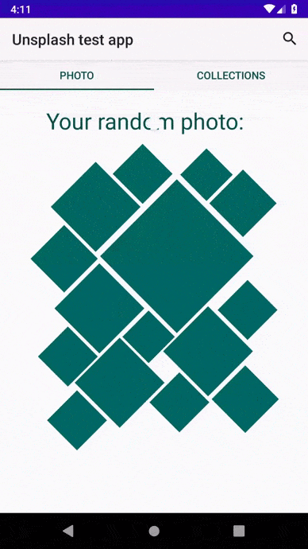
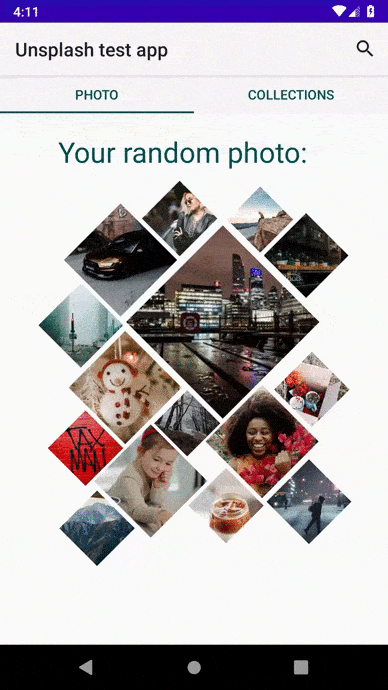
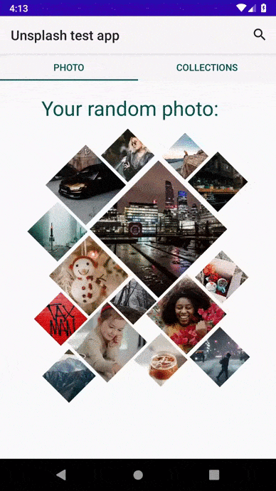
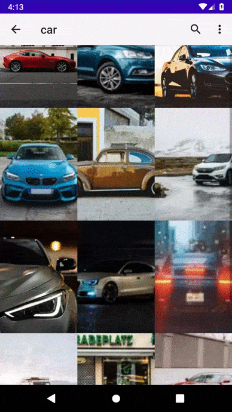
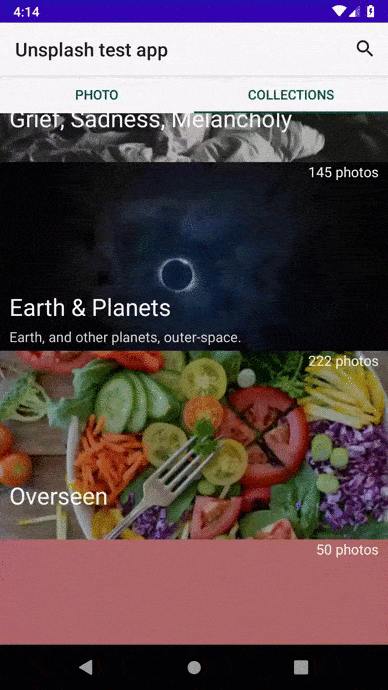

# Тестовое приложение для сервиса Unsplash.

В приложений используется следующий стек
> Kotlin  
> Dagger2  
> Retrofit2  
> Picasso  
> Kotlin Coroutines  
> Paging3  

Для работы приложения необходимо указать API key в модуле future-unsplash-impl, класса UnsplashServiceImpl.

### Главный экран со случайными изображениями

### Выбор изобрадения

### Список коллекций со страничной загрузкой

### Список изображений коллекции

### Поиск изображений

### Поиск коллекций

### Поиск изображенний в коллекциях

